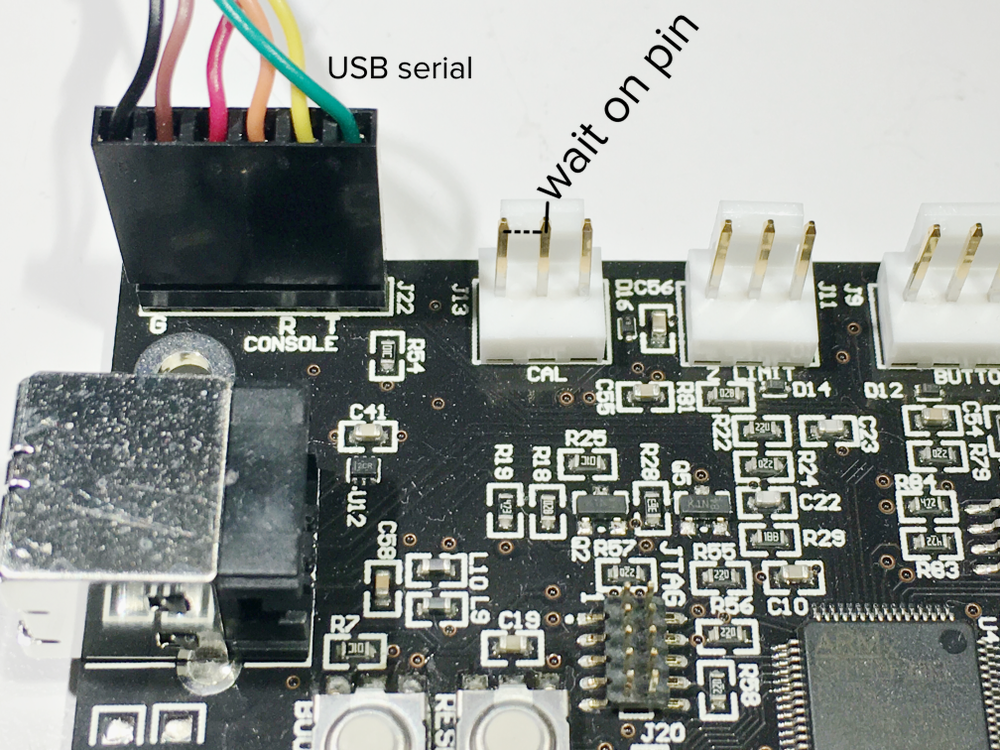

# OpenFL
This repository contains an API for interfacing with the Form 1/1+ 3D printer.

Contact: ben@formlabs.com matt@formlabs.com

# Quickstart
## PreForm
In order to use all of the firmware features and to set custom material files for Form 1/1+, you need a special version of PreForm, available here:
* https://s3.amazonaws.com/FormlabsReleases/Release/2.3.3/PreForm_2.3.3_release_OpenFL_build_1.dmg
* https://s3.amazonaws.com/FormlabsReleases/Release/2.3.3/PreForm_setup_2.3.3_release_OpenFL_build_1.exe

Use that version of PreForm to update the firmware. Next, you can load the custom material file, [Form_1+_FLGPCL02_100.ini](Form_1+_FLGPCL02_100.ini) from the PreForm UI and print with it.

## Python tools
To install dependencies, run
```
pip install -r requirements.txt
```

Then, have a look through the `examples` subfolder.


# Serial Output Commands
OpenFL provides commands for bidirectional communication with the printer while it is printing.

> **Caution**: With any covers removed, a Formlabs printer is no longer a Class 1 laser device. See [NOTICE.md](NOTICE.md).

The J22 header of the board, next to the USB plug, can be connected to an FTDI TTL-232R-3V3 six-pin cable. The end labeled "G" on the board is ground (black), not to be confused with the green wire that's at the other end of the plug. This serial port is at 115200 baud, so can be listened to with, e.g.,



This serial port is at 115200 baud, so can be listened to with, e.g., 
```
$ python -m serial.tools.miniterm /dev/tty.usbserial-AL009TJ4 115200
```
The serial port will show a number of status messages as the machine boots, for example. Most interesting, though, are the two FLP commands which allow programmed output. One writes strings to the serial port; the other writes the current Form 1/1+ system clock time (in ms). For example:
```
>>> from OpenFL import Printer, FLP
>>> p=Printer.Printer()
>>> p.write_block(0, FLP.Packets([FLP.SerialPrintClockCommand(),
                                  FLP.SerialPrintCommand('test\n'),
                                  FLP.SerialPrintClockCommand(),
                                  FLP.Dwell(s=1),
                                  FLP.SerialPrintClockCommand()]))
>>> p.start_printing(0, 1)
```
results in the following output on the serial line:
```
clock: 190845
test
clock: 190846
clock: 191848
```
Note that printing `'test\n'` took about 1 ms whereas the `FLP.Dwell(ms=1000)` command took 1002 ms.

Along with `FLP.SerialPrintClockCommand` there is `FLP.NopCommand`, which also holds a string; it does nothing but can be used to put markers or other metadata in FLP files.

# Mid-print input
## `FLP.WaitButtonPress`
`FLP.WaitButtonPress` displays a message and pauses the print until the user presses the button.

## `FLP.WaitOnPin`
`FLP.WaitOnPin` allows the printer to synchronize with other electronics: When the printer gets to a `FLP.WaitOnPin` packet, it pauses until a pin is pulled to ground. With this and `FLP.SerialPrintCommand`, a Form 1/1+ can be synchronized with another computer. For example, `FLP.SerialPrintCommand` could tell a computer to execute motor moves with additional motors, then when they complete, the computer can signal the printer to continue.

> **Caution**: With any covers removed, a Formlabs printer is no longer a Class 1 laser device. See [NOTICE.md](NOTICE.md).

The physical pin is the center pin of J13, the three-pin header labeled CAL next to the serial CONSOLE header. Shorting that center pin of J13 to ground (e.g., the J13 pin toward the back of the printer, toward the CONSOLE header) triggers `FLP.WaitOnPin` to continue.

# LEGAL DISCLAIMER
SEE [NOTICE FILE](NOTICE.md).

# Copyright
Copyright 2016 Formlabs

Released under the [Apache License](https://github.com/formlabs/openfl/blob/master/COPYING).
